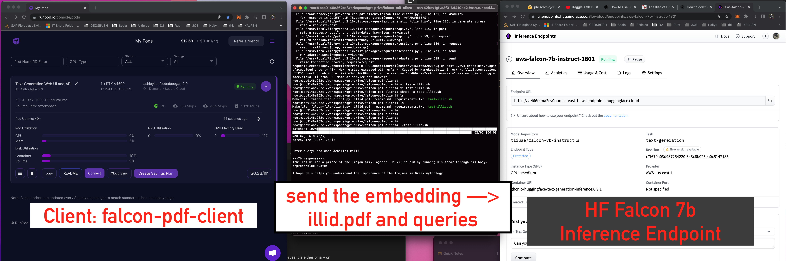

# Falcon PDF Client
> Code for client (text_generation_inference) to query a HuggingFace Endpoint

```
   | Falcon PDF Client | -----> | HuggingFace Inference Endpoint                           |
   | some-book.pdf     |        | running Falcon 7B, Protected                             |
                                | https://x@mple.us-east-1.aws.endpoints.huggingface.cloud |
```
## Diagram with RunPod.io and HF Interface Endpoints



## References
- Video: https://www.youtube.com/watch?v=hSQY4N1u3v0
- Code: https://gist.github.com/abhishekkrthakur/401c39d422fb6beff1600effe81f498a
- Falcon TGI: https://vilsonrodrigues.medium.com/serving-falcon-models-with-text-generation-inference-tgi-5f32005c663b

## Notes
- files with `ign-*` convention are git ignored, replaced the reference with your own files and source materials